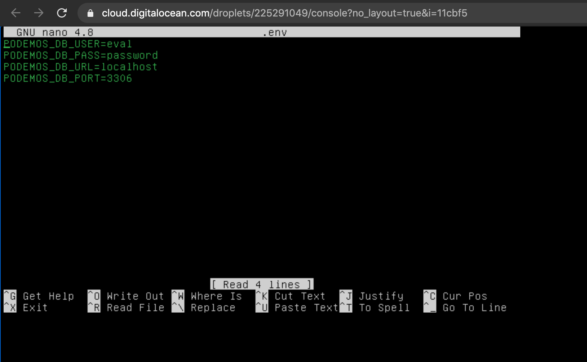
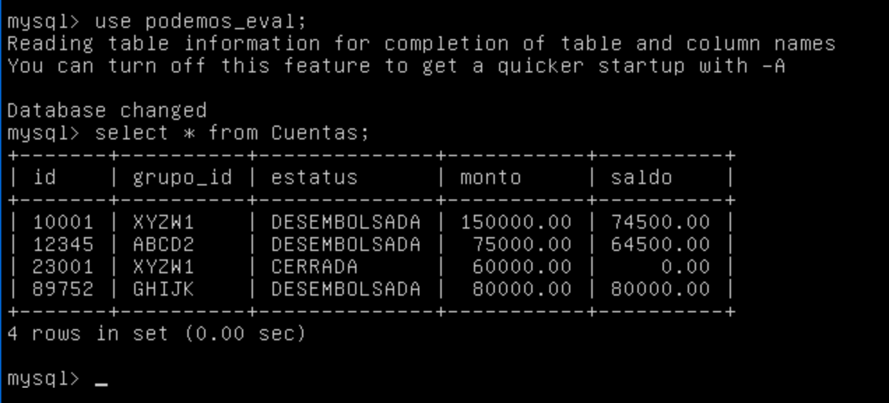
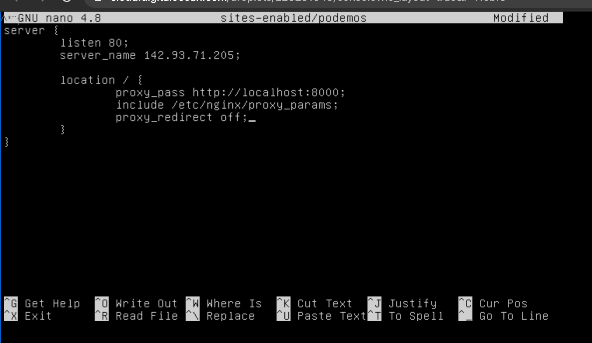

# Ejercicio Modelo API Interfaz

Hola! En este archivo te guiaré hacia la configuración de la BD y la app de Flask en esperanzas que todo vaya como debe.


#### ¿Qué utilicé?:
* Python 3.7
* Flask
* SQLALchemy
* MySQL
* Café

## Configuración de Python y los requerimentos para el proyecto
Tomando en cuenta que estamos en un servidor Ubuntu
actualiza tu sistema con
```
sudo apt update
```
Instalamos los requisitos
```
sudo apt install software-properties-common nginx
```
Agregamos un repositorio, presiona ENTER cuando te lo pida.
```
sudo add-apt-repository ppa:deadsnakes/ppa
```
Instalamos Python3.7
```
sudo apt install python3.7
```
Instalamos además pip
```
sudo apt install python3-pip
````
Instalamos virtualenv
```
python3.7 -m pip install virtualenv
```
Creamos nuestro ambiente virtual y lo activamos
```
python3.7 -m virtualenv .venv
source .venv/bin/activate
```
Clonamos el proyecto.
```
git clone https://github.com/GaboGomezT/podemos-take-home-project.git
```
entra a la carpeta db
```
cd podemos-take-home-project
```

Instalamos todos los requerimientos
```
pip install -r requirements.txt
```

## Configuración de Base de Datos

Instala el servidor de MySQL con 
```
sudo apt install mysql-server
```
entra a la carpeta db
```
cd db
```
con la siguiente línea crea el usuario eval
```
mysql < admin.sql
```
Ahora crea el esquema y las tablas con el usuario creado
```
mysql -ueval -ppassword modelo_script.sql
```
---
Ahora para poblar nuestras BD con los valores iniciales debemos conectar nuestra proyecto a la BD.

En la raíz del proyecto encontrarás un archivo llamadp *.EXAMPLE_env*, copia sus contenidos a un archivo llamado *.env* con los valores correspondientes.

El mío se ve así


Asegúrate te estar en la carpeta DB y tener nuestro ambiente virtual activado, podemos ejecutar el script populate_db.py
```
python populate_db.py
```
Un comando SQL sencillo desde la línea de comando nos demuestra como sí hay registros en las tablas.


## Ejecución de las pruebas unitarias
Nos dirigimos hacia la raíz del proyecto
```
cd ..
```
Ejecutamos las pruebas para asegurarnos que todo se encuentra bien
```
make tests
```

## Configuración de NGINX
Borramos las configuraciones por defecto
```
rm /etc/nginx/sites-enabled/default
```
creamos un archivo (usa el editor que te guste) y que tenga los siguientes contenidos
```
nano /etc/nginx/sites-enabled/podemos
```
server_name debería tener la IP de tu servidor


Permitimos tráfico http y reiniciamos nginx
```
sudo ufw allow http/tcp
sudo systemctl restart nginx
```

## Ejecutamos la API

Regresamos a nuestro proyecto
y entramos a la carpeta api
Aquí ejecutamos gunicorn
```
gunicorn -w 3 wsgi:app
```
## Listo! 
Ahora podemos usar nuestra api desde la web.

Puedes probar mi ejecución en 
```
http://142.93.71.205/clients
```
Para ver los demás endpoint revisa el archivo *ENDPOINT* en la raíz del proyecto